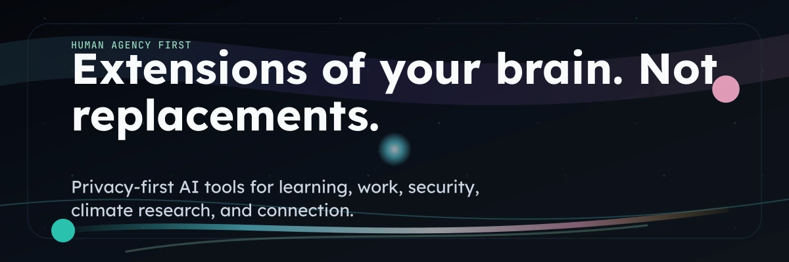

# NeuroBridge AI Labs

### Engaging Minds, Merging Ideas

---

## Who we are

NeuroBridge AI Labs builds tools that help people think, learn, and work with their own minds rather than against them. We start from a simple belief: technology should enhance human capability, never replace it, and it should be designed for the full spectrum of human experience.

Our work is neurodiversity-first and gender-equal by design. Founded by Emanuel Covasa (Ireland).

## What we build

| Product | What it does |
| --- | --- |
| **TaskSage** | Calm, ADHD-friendly task and project management. |
| **NeuroBridge EDU** | A learning companion for neurodivergent minds. |
| **NeuroBridge Adapt** | Adaptive support that learns each person's patterns. |
| **Neula** | An iOS "calm mirror" that reflects your ADHD patterns back, without judgement. |
| **CyberSage** | An AI security intelligence for authorised testing and defence. |
| **GreenCelt** | Sustainability and climate-research tooling with an Irish heart. |
| **PromptSage** | A framework for safe, robust prompting. |
| **TimeSage / FlowForge** | Focus, time, and flow tools. |

## How we work

- **Accessibility is the baseline.** Reduced cognitive load, consistent patterns, WCAG AA.
- **Human in the loop.** People make the calls; AI multiplies the capability.
- **Privacy-first.** We protect the data people trust us with.

## Get in touch

- Web: neurobridgelabs.eu
- Contact: ai@neurobridgelabs.eu

*Gratitude is the best attitude.*

